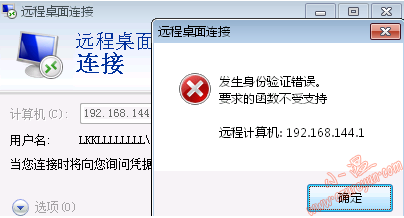

# WIN10远程桌面出现出现身份验证错误,要求的函数不受支持的解决办法

## 问题描述

从5月8\9日开始客户端Win10\WinSer2016突然无法访问测试环境下所有远程Win Ser2012/16资源，提示"出现身份验证错误。要求的函数不受支持... 这可能是由于CredSSP加密Oracle修正..." Win7中英文版本分别提示"发生身份验证错误。要求的函数不受支持"或"An authentication error has occurred and the required function is not supported"

## 问题截图
### in windows 10

### in windows 7


## 具体信息
```
远程桌面连接报错：

出现身份验证错误。要求的函数不受支持

远程计算机：*.*.*.*

这可能是由于CredSSP加密Oracle修正。

要了解详细信息，请访问https://go.microsoft.com/fwlink/?linkid=866660
```

## 问题排查
根据提示我们访问https://go.microsoft.com/fwlink/?linkid=866660

发现是因为CVE-2018-0886 的 CredSSP 更新导致该问题的发生。简单了解下CredSSP：

凭据安全支持提供程序协议 (CredSSP) 是处理其他应用程序的身份验证请求的身份验证提供程序。

CredSSP 的未修补版本中存在远程代码执行漏洞。 成功利用此漏洞的攻击者可以在目标系统上中继用户凭据以执行代码。任何依赖 CredSSP 进行身份验证的应用程序都可能容易受到此类攻击。

此安全更新通过更正CredSSP在身份验证过程中验证请求的方式来修复此漏洞。
## 解决方法
- 修改本地组策略：

  计算机配置>管理模板>系统>凭据分配>加密Oracle修正 选择启用并选择"易受攻击"。

  易受攻击–使用CredSSP的客户端应用程序将通过支持回退到不安全的版本使远程服务器遭受攻击，但使用CredSSP的服务将接受未修补的客户端。

- English:

  Group Policy ->Computer Configuration->Administrative Templates->System->Credentials Delegation>Encrypted Oracle Remediation change to Vulnerable

  Vulnerable – Client applications that use CredSSP will expose the remote servers to attacks by supporting fallback to insecure versions, and services that use CredSSP will accept unpatched clients.

**步骤如下**
1.打开本地组策略：


2.依次展开计算机配置>管理模板>系统>凭据分配>加密Oracle修正 ，启用加密Oracle修正并选择"易受攻击",单击确定


3.配置选项如下：


## 补充：加密 Oracle 修复

此策略设置适用于使用 CredSSP 组件的应用程序(例如: 远程桌面连接)。

CredSSP 协议的某些版本容易受到针对客户端的加密 oracle 攻击。此策略控制与易受攻击的客户端和服务器的兼容性。此策略允许你设置加密 oracle 漏洞所需的保护级别。

如果启用此策略设置，将根据以下选项选择 CredSSP 版本支持:

- 强制更新的客户端:使用 CredSSP 的客户端应用程序将无法回退到不安全的版本，使用 CredSSP 的服务将不接受未修补的客户端。注意: 在所有远程主机支持最新版本之前，不应部署此设置。

- 减轻:使用 CredSSP 的客户端应用程序将无法回退到不安全的版本，但使用 CredSSP 的服务将接受未修补的客户端。有关剩余未修补客户端所造成的风险的重要信息，请参见下面的链接。

- 易受攻击:如果使用 CredSSP 的客户端应用程序支持回退到不安全的版本，远程服务器将容易遭受攻击，使用 CredSSP 的服务将接受未修补的客户端。

## 参考资料
- [credssp-updates-for-cve-2018-0886-march-13-2018](https://support.microsoft.com/zh-cn/help/4093492/credssp-updates-for-cve-2018-0886-march-13-2018)

- [security-update-deployment-information-may-08-2018](https://support.microsoft.com/zh-cn/help/20180508/security-update-deployment-information-may-08-2018)

- [https://thehackernews.com/2018/03/credssp-rdp-exploit.html](https://thehackernews.com/2018/03/credssp-rdp-exploit.html)

- [https://blog.preempt.com/security-advisory-credssp](https://blog.preempt.com/security-advisory-credssp)

- [http://www.freebuf.com/vuls/166537.html](http://www.freebuf.com/vuls/166537.html)


