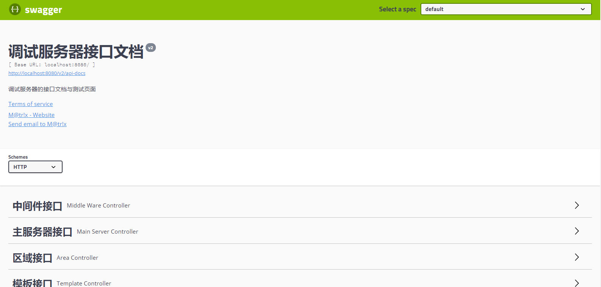
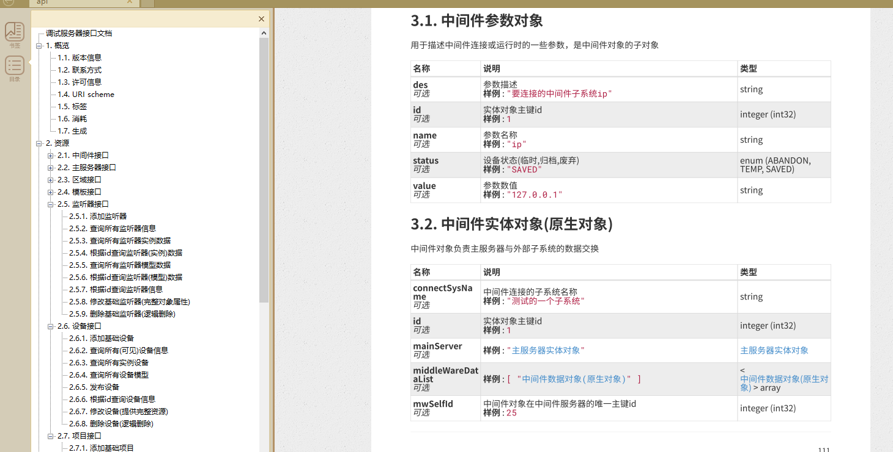

# spring-boot-自动化文档教程

## 技术栈
- 使用swagger2为底层技术
- 使用spring-fox用于适配spring mvc
- 使用ruby-asciidoctor-pdf 自动生成pdf文档

## maven依赖

`swagger.version` 我选择的是`2.9.0`,参考配置如图所示

```xml
    <!-- swagger版本选择  -->
	    <properties>
	        <swagger.version>2.9.0</swagger.version>
	    </properties>

        <!--swagger2 enable dependency-->
        <dependency>
            <groupId>org.springframework.boot</groupId>
            <artifactId>spring-boot-configuration-processor</artifactId>
            <optional>true</optional>
        </dependency>

        <dependency>
            <groupId>io.springfox</groupId>
            <artifactId>springfox-swagger2</artifactId>
            <version>${swagger.version}</version>
        </dependency>

        <dependency>
            <groupId>io.springfox</groupId>
            <artifactId>springfox-swagger-ui</artifactId>
            <version>${swagger.version}</version>
        </dependency>

        <dependency>
            <groupId>com.github.caspar-chen</groupId>
            <artifactId>swagger-ui-layer</artifactId>
            <version>0.0.4</version>
        </dependency>

        <dependency>
            <groupId>io.springfox</groupId>
            <artifactId>springfox-bean-validators</artifactId>
            <version>${swagger.version}</version>
        </dependency>
```

## 配置并使用
### 配置
这里我们使用Java Config进行配置
```java
/**
 * debug-server.
 * Des :
 *
 * @author : M@tr!x [xhyrzldf@gmail.com]
 * @date : 2018/5/31 16:46
 */
@Configuration
@EnableSwagger2
public class Swagger2Config {

    @Bean
    public Docket createRestApi() {
        return new Docket(DocumentationType.SWAGGER_2)
                .produces(Sets.newHashSet("application/json"))
                .consumes(Sets.newHashSet("application/json"))
                .protocols(Sets.newHashSet("http", "https"))
                .apiInfo(apiInfo())
                .forCodeGeneration(true)
                .select()
                // 指定controller存放的目录路径
                .apis(RequestHandlerSelectors.basePackage("com.zjty.server.controller"))
                .paths(PathSelectors.any())
                .build();
    }

    private ApiInfo apiInfo() {
        return new ApiInfoBuilder()
                // 文档标题
                .title("调试服务器接口文档")
                // 文档描述
                .description("调试服务器的接口文档与测试页面")
                .termsOfServiceUrl("https://github.com/xhyrzldf")
                .version("v2")
                .contact(new Contact("M@tr!x", "https://github.com/xhyrzldf", "xhyrzldf@gmail.com"))
                .build();
    }
}
```

详细的配置以及说明参考[官方文档](http://springfox.github.io/springfox/docs/current/#quick-start-guides)

### 使用
最常用的使用地方有两个，一是实体层的文档，二是接口层的文档

**实体层**
如下所示，这是一段经过简化后的实体类，不过已经包含了常用的基本信息了
- 在类上标注`@apiModel`说明这是一个实体类,并通过相应的标签填写相关信息,其中可以指定`parent`标签来使用来自父类的一些属性的文档注释
- 在属性上使用`@apiModelProperty`来对属性进行标注,并可以提供相应的样例
```java
@ApiModel(value = "主服务器实体对象", description = "主服务器内包含了区域,中间件,监听器三个部分",parent = BasePojo.class)
public class MainServer extends BasePojo {

    @ApiModelProperty(value = "服务器名称",example = "测试服务器")
    @JSONField(ordinal = 1)
    private String name;

    @ApiModelProperty(value = "服务器ip",example = "192.168.1.3")
    @JSONField(ordinal = 2)
    private String ip;
    
    @OneToMany(mappedBy = "mainServer", cascade = ALL)
    @JSONField(ordinal = 502)
    private List<Monitor> monitorList;

    @ManyToOne
    @JSONField(ordinal = 499)
    private Project project;
 }
```

**接口层**
同样一段经过简化后的接口层样例
- 使用`@Api`标注在类上,可以使用`value`或者`tags`标签来对该接口类进行一定的描述(推荐使用`tags`标签)
- 使用`@ApiOperation`对接口层的方法进行标注,使用合适的标签进行合适的注释

```java
@RestController
@RequestMapping("/areas")
@Api(tags = "区域接口")
public class AreaController {

    private final AAreaService areaService;

    @Autowired
    public AreaController(AAreaService areaService) {
        this.areaService = areaService;
    }


    /*以下为接口部分*/

    /**
     * <h5>查询所有基础区域信息</h5>
     * <p>
     *
     * @return {@link ServerResponse}
     */
    @ApiOperation(value = "查询所有基础区域信息", notes = "查询所有基础区域信息")
    @Cacheable(cacheNames = "redis", key = "'areaList'", sync = true)
    @GetMapping
    public ServerResponse findAllSeenAreas() {
        return success(areaService.findSeenAll()
                .stream()
                .map(this::AreaView)
                .collect(toList()));
    }


    /**
     * 根据id查询基础区域信息
     * 映射步骤为 : 查询->转换视图对象->包装返回值->错误情况的处理
     *
     * @return {@link ServerResponse}
     */
    @ApiOperation(value = "根据id查询基础区域信息", notes = "根据id查询基础区域信息")
    @GetMapping("/{id}")
    public ServerResponse findSeenAreaById(@PathVariable("id") Optional<Integer> id) {

        return id.map(areaService::findSeenOneById)
                .map(this::AreaView)
                .map(ServerResponse::success)
                .orElse(error(NOT_FOUND));
    }

}
```

**常用注解**
- @Api：用在类上，说明该类的作用
- @ApiOperation：用在方法上，说明方法的作用
- @ApiImplicitParams：用在方法上包含一组参数说明
- @ApiImplicitParam：用在@ApiImplicitParams注解中，指定一个请求参数的各个方面
  - paramType：参数放在哪个地方
    - header–>请求参数的获取：@RequestHeader
    - query–>请求参数的获取：@RequestParam
    - path（用于restful接口）–>请求参数的获取：@PathVariable
    - body（不常用）
    - form（不常用）
  - name：参数名
  - dataType：参数类型
  - required：参数是否必须传
  - value：参数的意思
  - defaultValue：参数的默认值
- @ApiResponses：用于表示一组响应
- @ApiResponse：用在@ApiResponses中，一般用于表达一个错误的响应信息
- code：数字，例如400
- message：信息，例如”请求参数没填好”
- response：抛出异常的类
- @ApiModel：描述一个Model的信息（这种一般用在post创建的时候，使用@RequestBody这样的场景，请求参数无法使用@ApiImplicitParam注解进行描述的时候）
- @ApiModelProperty：描述一个model的属性

详细注解解释参考官方[Github-wiki文档](https://github.com/swagger-api/swagger-core/wiki/Swagger-2.X---Annotations)

### 访问
配置完之后启动项目，访问`ip:port/swagger-ui.html`即可进入默认的定制页面，页面的本质是通过访问`v2/api`接口获得json接口相关的json数据，因此如果想要个性化定制页面，只需访问该接口即可。如下图所示。


## 自动生成pdf文档
有了格式化的json数据，生成格式化的文档自然也不是难事，只需要找到合适的工具。这里我们选择ruby的`ruby-asciidoctor-pdf`工具,该工具可以将adoc格式化文档转储为pdf文件，并且对中文有着良好的格式支持。 这里生成pdf文档的思路如下
- 将`/v2/api`接口下的json数据转换成`adoc`文件
- 利用`asciidoctor-pdf`将`adoc`文件转换为`pdf`文件

### maven依赖
```xml

        <!--swagger pdf dep-->
        <dependency>
            <groupId>org.pegdown</groupId>
            <artifactId>pegdown</artifactId>
            <version>1.6.0</version>
            <scope>test</scope>
        </dependency>
        <dependency>
            <groupId>io.github.swagger2markup</groupId>
            <artifactId>swagger2markup</artifactId>
            <version>1.3.1</version>
            <scope>test</scope>
        </dependency>


            <plugin>
                <groupId>org.apache.maven.plugins</groupId>
                <artifactId>maven-surefire-plugin</artifactId>
                <version>2.20</version>
                <configuration>
                    <systemPropertyVariables>
                        <swaggerOutputDir>${project.basedir}/src/main/resources/doc</swaggerOutputDir>
                        <asciiDocOutputDir>${project.basedir}/src/main/resources/doc/api</asciiDocOutputDir>
                    </systemPropertyVariables>
                    <skip>true</skip>
                </configuration>
            </plugin>
```
- 其中`swaggerOutputDir`设置的为adoc文件的根目录
- `asciiDocOutputDir`相比于上面多了一层/api,这是自动生成的adoc文件的名称

### 运行并生成adoc文档
这里我们使用spring-boot-test来得到运行时的环境，读取`/v2/api`接口，生成相应的adoc文档，示例代码如下
```java
/**
 * Swagger2MarkupTest
 *
 * @author M@tr!x
 */
@RunWith(SpringRunner.class)
@SpringBootTest(classes = DebugServerApplication.class, webEnvironment = SpringBootTest.WebEnvironment.RANDOM_PORT)
@ActiveProfiles("dev")
public class Swagger2MarkupTest {


    @Autowired
    private WebApplicationContext context;

    private MockMvc mockMvc;

    private static final Logger LOG = LoggerFactory.getLogger(Swagger2MarkupTest.class);

    @Before
    public void setupMockMvc() {
        mockMvc = MockMvcBuilders.webAppContextSetup(context).build();
    }

    /**
     * 自动生成adoc文件
     * @throws Exception e
     */
    @Test
    public void createSpringFoxSwaggerJson() throws Exception {
        MvcResult mvcResult = this.mockMvc.perform(get("/v2/api-docs")
                .accept(MediaType.APPLICATION_JSON))
                .andExpect(status().isOk())
                .andReturn();
        MockHttpServletResponse response = mvcResult.getResponse();
        String swaggerJson = response.getContentAsString();
        LOG.info("--------------------swaggerJson create --------------------");
        convertAsciidoc(swaggerJson);
        LOG.info("--------------------swagon.json to asciiDoc finished --------------------");
    }

    /**
     * 将swagger.yaml或swagger.json转换成漂亮的 AsciiDoc
     * 访问：http://localhost:9095/v2/api-docs
     * 将页面结果保存为src/main/resources/swagger.json
     */
    private void convertAsciidoc(String swaggerStr) {
        Path outputFile = Paths.get(System.getProperty("asciiDocOutputDir"));
        Swagger2MarkupConfig config = new Swagger2MarkupConfigBuilder()
                .withMarkupLanguage(MarkupLanguage.ASCIIDOC)
                .withOutputLanguage(Language.ZH)
                .withPathsGroupedBy(GroupBy.TAGS)
                .withGeneratedExamples()
                .withoutInlineSchema()
                .build();
        Swagger2MarkupConverter converter = Swagger2MarkupConverter.from(swaggerStr)
                .withConfig(config)
                .build();
        converter.toFile(outputFile);
    }
}
```

### 将aodc文档转化为pdf文档
#### 安装ruby
使用`awesome-tool`下的ruby安装包安装ruby环境
#### 安装cjk依赖
命令行下使用`gem install asciidoctor-pdf-cjk-kai_gen_gothic`
#### 安装中文字体
安装ruby中的安装包里有一份中文字体文件使用`gem environment`命令在结果中寻找到`INSTALLATION DIRECTORY: E:/Ruby24-x64/lib/ruby/gems/2.4.0`如下路径，然后在这个目录下面进入目录 `gems/asciidoctor-pdf-cjk-kai_gen_gothic-0.1.1/data/fonts`， 将下载的字体都放进去。

### 美化adoc并生成pdf
在生成的aodc文档的开始添加如下格式配置，目的是为了优化生成pdf的目录结构.
```
:toclevels: 3
:numbered:

```
接着执行
```
asciidoctor-pdf -r asciidoctor-pdf-cjk-kai_gen_gothic -a pdf-style=KaiGenGothicCN build/api.adoc
```
注意最后的`api.adoc`换成自己的文档名，稍作等待，就可以在同目录下看到一份生成好的pdf文档了。文档如下图所示。


## 参考文章
- [spring-fox-docs](http://springfox.github.io/springfox/docs/current/#quick-start-guides)
- [Github-wiki文档](https://github.com/swagger-api/swagger-core/wiki/Swagger-2.X---Annotations)
- [SpringBoot系列 - 集成Swagger2](https://www.xncoding.com/2017/07/08/spring/sb-swagger2.html)
- [使用Swagger生成RESTful API文档](https://www.xncoding.com/2017/06/09/web/swagger.html)

