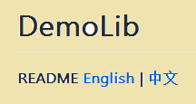
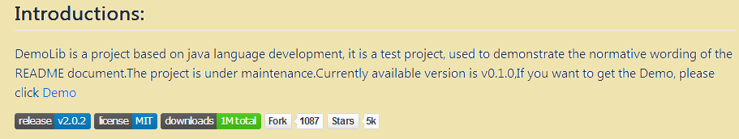
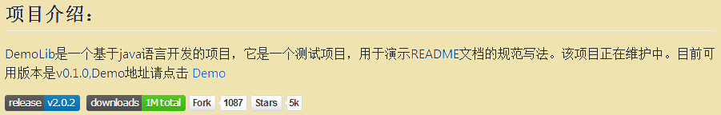
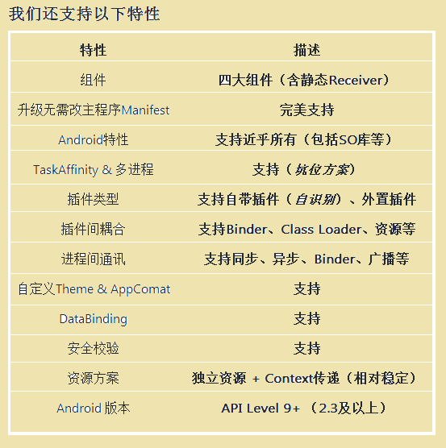
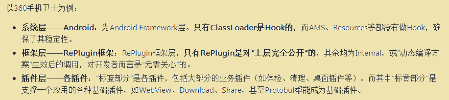
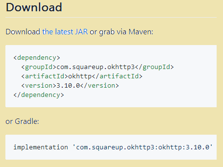
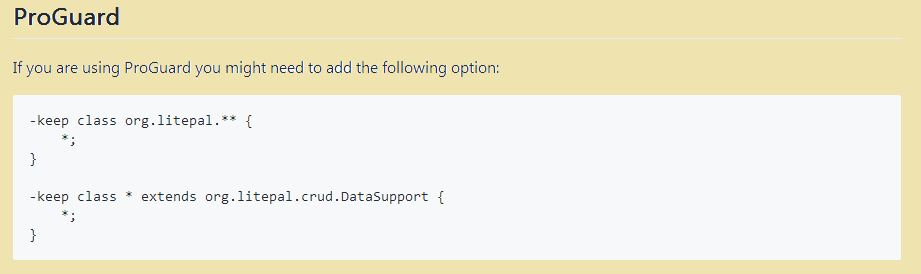
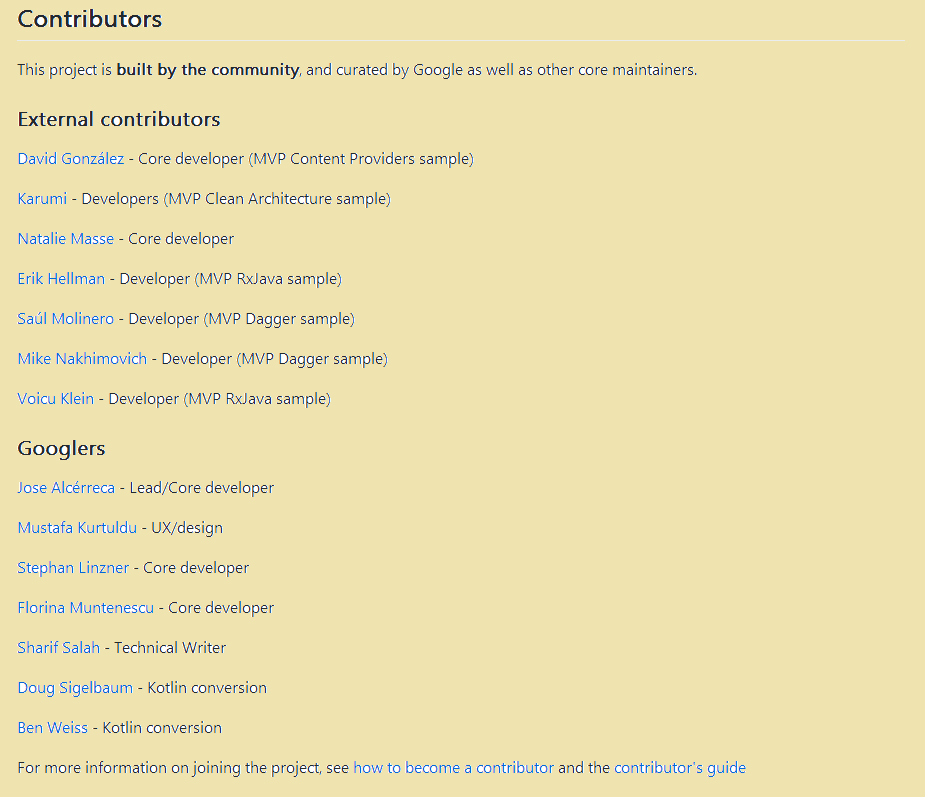
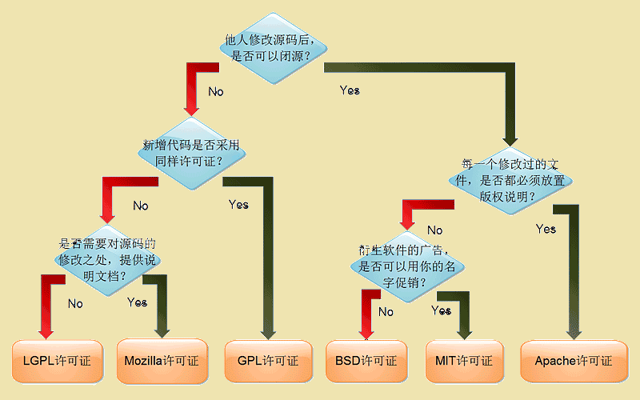
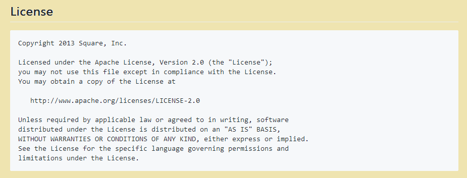

看过很多开源库，发现有些库的文档写的一团糟，有的甚至就是一个标题，让你自己下载之后运行，自己摸索，看的很头疼。而那些使用量大的库的文档写的很标准，很详细，看的很舒服。

README文档写的好的话能减少很多使用成本，能帮助这个库让更多人了解，更多的人用，可以说好的文档就是一个门面。
**有好的 README 文档的项目不一定是一个好开源项目，但一个好开源项目一定有一个好的 README。**

下面就简单的总结一下README文档规范写法。（这只是我个人根据github上几百个大型开源库总结出来的，如你有更好的意见，欢迎留言。）

#### 一、README文档的组成部分

看过很多开源框架的README文档，综合一下，大概有以下几部分组成：

> * （一）国际化
> * （二）项目工程介绍
> * （三）项目的使用效果图
> * （四）项目特点
> * （五）项目的基本结构（架构）
> * （六）集成方式
> * （七）使用方法
> * （八）混淆
> * （九）贡献者/贡献组织
> * （十）鸣谢
> * （十一）版权信息

----

#### 二、下面就每个部分简单的分析一下：

> （一）国际化

github是面向全球的一个开源网站，所以不要局限于中文文档，建议写一个英文的README，让来自全球的人都能更方便的了解你的项目。推荐写法，在REAMDE开头写上国际化引用地址：

比如：

> （二）项目工程介绍

项目介绍是必不可少的，它能让别人快速了解项目。项目介绍主要包括：
* 项目名称、logo（没有logo就不写）
* 这个开源项目是做什么的？
* 这个项目是什么语言编写的？
* 这个项目目前被多少人用到了，有多少好评等？
* 项目维护、依赖更新状态（如果有的话，这也可以用）等
* 项目可用版本及其他版本，以及每个版本的更新信息记录
* Demo 或官网地址（如果有）

效果图如下所示：

英文版：

中文版：

----

* 上述案例里面那些图标，请参考这个网站 [Shields.io](http://shields.io/)，打开之后想用哪个直接复制就可以了，同时它也支持自定义样式。

----

> （三） 项目的使用效果图

如果是一些自定义控件或者项目的演示效果的，基本都会放上演示效果图，可以是图片，也可以是gif图。
建议：静态的页面的放截图，交互很复杂的建议放gif图。 如果功能比较多，建议每个功能一张效果图。

示例如下：

**LoveHeartView使用示意图如下图所示：**

----

> （四）项目特点

主要是介绍项目的特点，方便别人查看和了解该项目。

比如 **360的RePlugin框架的特点**就写的很详细：

----

> （五）项目的基本结构（架构）

这里主要介绍项目的各个组成部分，如果是框架，可以附带架构图解；如果是其他的，可以提供一些UML分析图，顺便分析一下源码也行的。

比如 **360的RePlugin架构图解** 如下所示：

----

> （六）集成方式

一般的项目传到jcenter上面或者AS插件传到jetbrains的话 一般会附带相关的集成方式的说明。（如果没有这些措施的话，这一步可以略过不看。）

比如 **okhttp** 就有详细的3种集成方式：

一个是下载Jar包；一个是引用Maven库；第三个是添加Gradle依赖：

----

> **（七）使用方法**

一般的README必不可少的，最重要的就是用法，主要包括：安装，运行，编译，部署，debug，该github上的这个库如何在自己的项目中使用，以及需要注意的问题，版本更新适配问题等等。

这里就拿 **Glide** 举例说明，Glide里面有一个详细的wiki使用文档的，首页的README里面也写了一个简单的基本用法，如下图所示：

----

> （八）混淆

一般来说，开源库都会设置一些混淆规则的，部分项目由于项目类型特殊之处，所以就没有混淆这一项，具体的看开源项目来定。

例如**LitePal这个开源库的混淆** 如下图所示：

----

> （九）贡献者/贡献组织

比如 **谷歌推出的 [sample](https://github.com/googlesamples/android-architecture) 里面就有贡献者/贡献组织信息**，如下图所示：

> （十）鸣谢

这个主要是引用了哪些开源技术，这里可以做一些鸣谢，表示对别人的尊重，其实也是一个引用声明，避免因为版权而引起不必要的纠纷。

----

> （十一）版权信息

版本很重要，开源许可证很重要，如果没有生命版权，可能会因为一些侵权行为而无法很好的维权，版权信息可以保护作者的权益（个人理解）。

世界上的开源许可证，大概有上百种。很少有人搞得清楚它们的区别。最流行的有六种：**GPL、BSD、MIT、Mozilla、Apache、LGPL**

乌克兰程序员Paul Bagwell，画了一张分析图，说明应该怎么选择。这是我见过的最简单的讲解，只用两分钟，你就能搞清楚这 [六种许可证之间的最大区别](http://www.ruanyifeng.com/blog/2011/05/how_to_choose_free_software_licenses.html)。

比如 **Picasso 里面的版权信息**，如下图所示：

