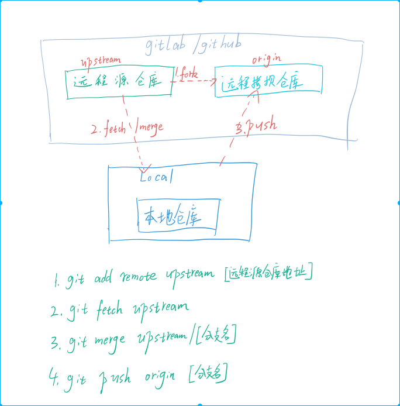

# 如何更新fork的远程仓库

## 基本概念

这里有三个仓库名词

- 远程源仓库 是指 项目的初始仓库也是中央仓库
- 远程拷贝仓库 是指 从中央仓库fork到自己命名空间下的仓库
- 本地仓库 是指 自己本地的git仓库

## 思路与图示

更新fork的整体思路是将远程源仓库的更新fetch到本地仓库,然后合并到指定分支后再push上传到自己的远程拷贝仓库。如图所示

## 参考命令

步骤如下

1.将自己的本地仓库与远程源仓库关联(这一步只需要操作一次),并将其命名为upstream

`git add remote upstream [远程仓库地址]`

2.抓取远程源仓库的更新提交 

`git fetch upstream`

3.切换到工作分支 , 例如 develop分支

`git checkout develop`

4.将远程源仓库的指定分支更新合并更新到工作分支

`git merge upstream/develop`

5.将本地工作分支push提交到自己的远程fork仓库

`git push origin`

## 参考资料

[Syncing a fork](https://help.github.com/articles/syncing-a-fork/)

[Configuring a remote for a fork](https://help.github.com/articles/configuring-a-remote-for-a-fork/)

